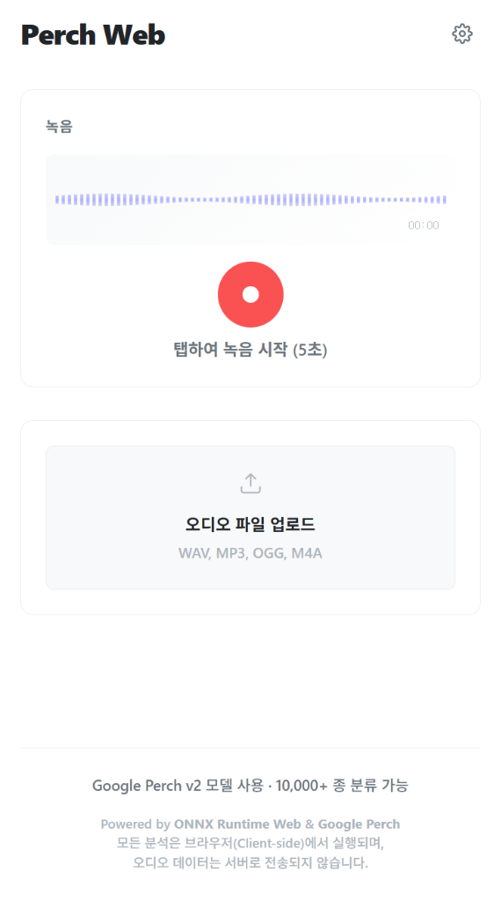

# Perch Web: AI Bird Vocalization Classifier


**Perch Web**은 Google의 **Perch v2** 모델을 활용하여 새 소리를 실시간으로 식별하는 경량 웹 애플리케이션입니다.
WebAssembly 기반의 ONNX Runtime Web 기술을 도입하여, 브라우저 내(Client-side)에서 모든 추론 과정을 수행합니다. 

## [Live Page](https://wonjj6768.github.io/perch-web-v2/web/)



## 주요 기능 (Key Features)

*   **실시간 분석**: 5초 단위 오디오 즉시 분석 및 식별
*   **대규모 분류**: Google Perch v2 모델 기반 10,000종 이상 식별
*   **온디바이스 처리**: 100% 온디바이스 처리
*   **PWA 지원**: 앱처럼 설치 가능 및 오프라인 동작
*   **파일 업로드**: 다양한 오디오 포맷(WAV, MP3 등) 분석 지원

## License

This project is licensed under the MIT License.

### Third-Party Licenses

*   **Google Perch v2 Model**: Copyright 2024 The Perch Authors. Licensed under Apache License 2.0.
*   **ONNX Runtime Web**: Copyright (c) Microsoft Corporation. Licensed under MIT License.
*   **Pretendard Font**: Copyright (c) 2021 Kil Hyung-jin. Licensed under SIL Open Font License 1.1.


## 전체 파일 분석 (업데이트)

- **전체 길이 분석**: 파일을 5초씩 나누어 처음부터 끝까지 처리합니다. 마지막 짧은 구간만 뒤쪽을 무음으로 채웁니다. 최대 50MB / 20분이며, 브라우저가 해당 코덱을 디코딩할 수 있어야 합니다.
- **타임라인 + 구간 듣기**: 각 구간의 시작/끝 시간, 종 후보와 모델 점수를 확인하고 바로 재생합니다. 종 요약, 한국어/학명 검색, 20구간 단위 페이지를 제공합니다.
- **진행률 + 중지**: 진행률을 확인하고 중지할 수 있습니다. 이미 실행 중인 한 구간의 ONNX 추론은 끝날 때까지 기다리며, 완료된 구간만 남깁니다. 새 파일을 선택하면 이전 작업의 늦은 결과는 무시됩니다.
- **JSON / CSV 저장**: 원본 파일명, 분석 모델, 설정, 완료/중지/실패 상태와 구간별 결과를 저장합니다. 원본 음성은 내보내지 않습니다. JSON에는 전체 길이와 분석 시각 등 메타데이터도 포함됩니다.
- **수동 녹음 분석**: 설정에서 자동 분류를 끄면 녹음을 먼저 들어 보고 ‘분석 시작’을 누를 수 있습니다.
- **다운로드/캐시 개선**: 모델을 한 번 다운로드한 바이트로 세션을 생성합니다. 오디오 SHA-256 키로 원시 모델 출력을 캐시하고 매 요청의 표시 설정을 적용합니다.

### 점수 해석

현재 모델은 기존 **Google Perch v2 ONNX**입니다. 표시 점수는 기존 softmax 후처리의 상대적인 모델 점수이며, 실제 정답 확률로 보정된 값이 아닙니다. 겹치는 울음, 잡음, 종의 지역적 분포 등에 따라 오인식할 수 있습니다. 자동 관찰 기록 확정이나 생태학적 결론 전에 원음을 확인하세요. 설정 변경은 다음 분석에 적용되며 ‘현재 설정으로 다시 분석’을 누르면 반영됩니다.

### 로컬 실행과 확인

정적 웹 앱으로, 빌드 과정이나 npm 의존성 설치가 필요하지 않습니다.

```sh
python3 -m http.server 8000
# http://localhost:8000/web/ 열기
npm test
npm run check
```

테스트에는 파일 전체/끝 구간 처리, 중지, CSV 이스케이프, 설정 변경 시 캐시 정확성, 중복 모델 다운로드 방지, 직렬 추론, 녹음 MIME 및 권한/종료 경합 검사가 포함됩니다. 단위 테스트는 ONNX/마이크를 모킹하며, 실제 모델의 정확도 또는 브라우저별 코덱 지원을 검증하는 것은 아닙니다. 실제 모델/런타임 첫 다운로드에는 인터넷이 필요하고 메모리를 많이 사용합니다. 오프라인 분석은 앱 셸뿐 아니라 실제 사용한 모델 및 런타임 파일이 브라우저 캐시에 남아 있는 경우에만 가능합니다. 브라우저의 저장 공간 정리, 사생활 보호 모드, CDN 장애 등에 따라 다시 다운로드해야 할 수 있습니다.

### 실제 브라우저 / 모델 CI

`.github/workflows/verify.yml`은 PR에서 단위/구문 검사와 별도 실제 Chromium 테스트를 실행합니다. 브라우저 테스트는 실제 ONNX Runtime Web 및 현재 Perch 모델을 다운로드하며 추론을 모킹하지 않습니다. 12.25초 합성 신호로 전체 구간/끝 구간, 1초 교체 파일, 구간 재생 위치, JSON/CSV, 모바일 폭을 검증합니다. 합성 신호이므로 **생물학적 종 식별 정확도 검증은 아닙니다**. 실행 결과 JSON/CSV와 화면은 CI artifact에서 7일 동안 볼 수 있습니다. 모델 다운로드 때문에 인터넷, 충분한 RAM 및 수 분의 실행 시간이 필요합니다.

```sh
npm ci
npx playwright install chromium
npm run test:browser
```

GitHub Pages는 현재 `master` 브랜치의 `/`에서 배포됩니다. 기능 브랜치 및 Draft PR만으로는 운영 사이트가 바뀌지 않습니다. PR의 모든 검증이 성공한 뒤 결과를 검토하고, 별도의 승인 후 병합하여 배포하세요.
